<div align="center">

# 👋 Hi, I'm Taha

### `Software Engineering Student` · `Cybersecurity` · `Ethical Hacking`


</div>

---

<div align="center">

### 🛡️ `whoami`

**Software Engineering Undergraduate**
**Bahria University Karachi Campus**

 Learning cybersecurity one lab, packet, and vulnerability at a time.

</div>

---

## 🧑‍💻 About Me

```text
┌──[taha@kali]─[~]
└─$ whoami

Software Engineering Student
Cybersecurity Learner
Ethical Hacking Enthusiast
Future Penetration Tester
```

I'm a Software Engineering student currently focusing on **cybersecurity, penetration testing, networking, and ethical hacking**.

I enjoy learning by actually getting my hands dirty — setting up labs, breaking things in controlled environments, analyzing how systems work, and figuring out how they can be secured.

---

## 🛡️ Cybersecurity Journey

```text
                    ┌─────────────────────┐
                    │ SOFTWARE ENGINEERING│
                    └──────────┬──────────┘
                               │
                               ▼
                    ┌─────────────────────┐
                    │     NETWORKING      │
                    └──────────┬──────────┘
                               │
                               ▼
                    ┌─────────────────────┐
                    │   LINUX & SECURITY  │
                    └──────────┬──────────┘
                               │
                               ▼
                    ┌─────────────────────┐
                    │   ETHICAL HACKING   │
                    └──────────┬──────────┘
                               │
                               ▼
                    ┌─────────────────────┐
                    │ PENETRATION TESTING │
                    └──────────┬──────────┘
                               │
                               ▼
                    ┌─────────────────────┐
                    │    RED/BLUE TEAM    │
                    └─────────────────────┘
```

---

## ⚔️ What I'm Into

<table>
<tr>
<td align="center" width="33%">

### 🔐 Security

Penetration Testing
Ethical Hacking
Vulnerability Assessment
Web Security
SOC

</td>

<td align="center" width="33%">

### 🌐 Networking

TCP/IP
VLANs
Routing
Network Security

</td>

<td align="center" width="33%">

### 🐧 Systems

Linux
Kali Linux
Bash
Python

</td>
</tr>
</table>

---

## 🧪 My Lab

```bash
┌──[taha@kali]─[~/lab]
│
├── 🔴 Metasploitable
├── 🔴 OWASP BWA
├── 🐧 Kali Linux
├── 🪟 Windows VMs
├── 🌐 Cisco Packet Tracer
│
└── $ ./keep-learning.sh
```

I use isolated environments and virtual machines to practice security concepts safely.

---

## 🚀 Projects

### 🛰️ SolarVision-AR

> AI + Computer Vision + Augmented Reality

My Final Year Project exploring how a mobile application can scan rooftops, detect relevant areas using AI/computer vision, and assist with solar panel planning through AR.

`Kotlin` `Android` `AI` `Computer Vision` `AR`

---

### 🛡️ Smart Network Intrusion Detection System

> Network Security + Machine Learning

A network intrusion detection project designed to analyze network traffic and identify potentially malicious or anomalous activity.

**Role:** Contributor

`Python` `Machine Learning` `Network Security` `Intrusion Detection`

---

### 🌐 Computer Communication & Networks

> Multi-building university network simulation

A Cisco Packet Tracer networking project involving VLAN segmentation, trunking, DHCP, RIPv2, port security, DNS, web services, and email services.

`Cisco Packet Tracer` `VLAN` `RIPv2` `DHCP` `Network Security`

---

### ✈️ Airline Reservation System

> Full-stack university software engineering project

A flight booking and reservation system developed with C#, ASP.NET and SQL Server.

`C#` `ASP.NET` `SQL Server` `Bootstrap`

---

## 📚 Currently Learning

```text
🔴 Penetration Testing
🔴 Web Application Security
🔴 Network Security
🔴 Linux
🔴 Python for Cybersecurity
🔴 Ethical Hacking
🔴 Red/Blue Team Fundamentals
```

---

## 🏆 Certifications & Training

🎓 IBM Cybersecurity Analyst Professional Certificate

🛡️ Ethical Hacking / CEH-focused Training

🐧 Linux & Bash Training

🐍 Python Training

🔐 Cybersecurity & Penetration Testing Labs

---

## 📊 GitHub Stats

<p align="center">
  
</p>

---

## 🐍 Contribution Snake

<p align="center">
  
</p>

---

## 🌐 Connect With Me

<div align="center">

<a href="https://github.com/13eeCoder">

</a>

<a href="https://www.linkedin.com/in/muhammad-taha-siddiqui-mts/">

</a>

</div>

---

<div align="center">

### `root@taha:~# ./future.sh`

**Learn → Practice → Break → Understand → Secure**

<br>


</div>
